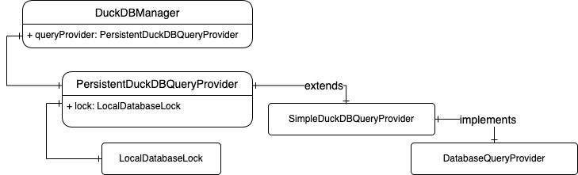
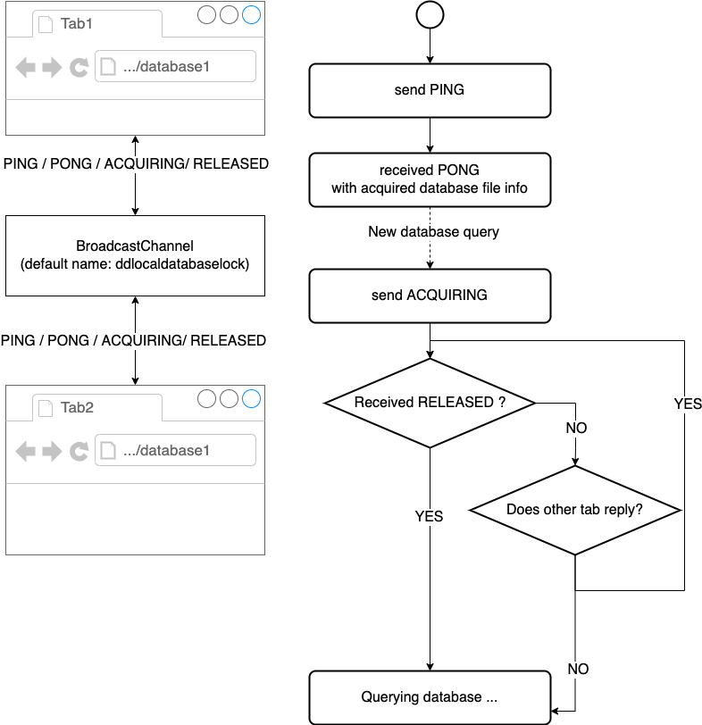

# Breaking Changes (December 2023)

Here are some breaking changes after the local data persistence feature was merged into the main branch:

[TOC]

## The new hierarchy of database query-related classes



### Class `DuckDBManager`

file: `packages/datadocs/src/app/store/db-manager/duckdb.ts`

> ❗️ We removed the abstract class `BaseDBManager`, which is the parent class of `DuckDBManager`.
>
> And the reason we removed `BaseDBManager` is that it exhibited high coupling, yet it did not serve as a base class for another class like `DuckDBManager`.

We continue to use this database manager and it no longer extends any class.   
Moreover, it has a member named `queryProvider`. This member is a `PersistentDuckDBQueryProvider`. You can get more details about it in the subsequent section.

### New Class `PersistentDuckDBQueryProvider` and `SimpleDuckDBQueryProvider`

- file: `packages/local-storage/lib/db-manager-persistent.ts`
- file: `packages/local-storage/lib/db-manager-simple.ts`
- file: `packages/local-storage/lib/db-manager-spec.ts`

Both of these two classes have implemented interface `DatabaseQueryProvider`.

And here is the core difference between these two classes, `PersistentDuckDBQueryProvider` be can understood as `SimpleDuckDBQueryProvider` with an extra database file access lock.

In conclusion, all app logic about users' local data and persistent DuckDB data should use `PersistentDuckDBQueryProvider` to store. Here is a snippet about using it:

``` typescript
const q = new PersistentDuckDBQueryProvider(duckdb, "conn", {
   // we can put config for DuckDB `open` method in here. for exmaple:
   // checkpointWALSize: 0,
});
await q.useDatabase('test.db');
const conn = await q.createConnection();
const rows = await getObjectsFromQueryResult(await q.queryAll(`SHOW ALL TABLES`));
await q.closeConnection(conn);
```

### Class `LocalDatabaseLock`

This class is very important for the new query provider class `PersistentDuckDBQueryProvider`.   
The new persistent DuckDB query provider requires it to manage access to the same database file across multiple browser tabs within a single browser




### New Interface `DatabaseQueryProvider`

This new interface replaces the old `BaseDBManager` for querying the database.

And please do not add unecessary/high level APIs into this interface. It should be database agnostic, meaning that it is just an interface for managing database connection and passing SQL.

``` typescript
createConnection(): Promise<string>;
hasConnection(connID: string): boolean;
closeConnection(connID: string): Promise<void>;

/** query the database using cursor and load results progressively */
query(sql: string, connId: string);

/** query all results at once  */
queryAll(queryStr: string, connId?: string | undefined | null, limit?: number)
```

> 📝 We can just implement another query provider for Remote DuckDB, BigQuery and other relational database in the future for more convenient compatibility with different databases.

## 🔔 Considerations for Writing Code

1. We should use the `await` keyword to ensure the connection is closed properly. (We didn't await it before, which may cause memory issues when a user queries in two tabs)
2. Current Duck DB is persistent in the user's browser. So please do not save any temporary data or any temporary view for optimization purposes into the persistent database. And please remember to clean up unused tables/views.

### New utilities for querying DuckDB

`ArrowAsyncRowReader`, `batchesToObjects` and `batchesToArrays`:

``` typescript
const reader = new ArrowAsyncRowReader(await this.dbManager.query(query, connId));
for await (row of reader) {
  // ....
}

// OR load all rows:
const batches = await this.dbManager.queryAll(query, connId);
const records = batchesToObjects(batches);
console.log(records)
```
