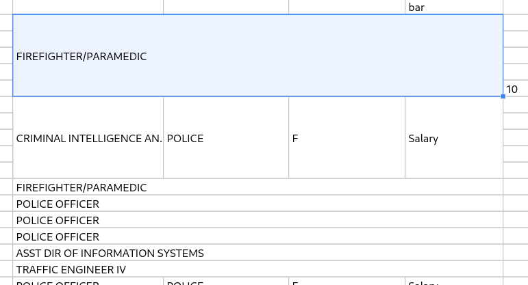

# Ability to merge cells (#15)

<https://github.com/xdatadocs/canvas-datagrid/pull/15>

## New components in the grid

Merged cells:  


### New attributes

`allowMergingCells`:

This allows enabling of the _merge cells_ feature. When enabled users gain the
ability to merge whole selections as single cells, or as vertically/horizontally
arranged ones. 

#### In `NormalCellDescriptor`

* `isMerged: boolean`: Whether the cell is a merged cell.
* `isMergedToBaseCell: boolean`: Whether this is a child cell. If true, the cell 
is not drawn.
* `mergingColumnIndex: number`: Real col index of the last merging cell on the 
right (if merging), or its own real index.
* `mergingRowIndex: number`: Real row index of the last merging cell at the bottom
(if merging), or its own real index.
* `mergingHeight: number`: The height added to this merging cell from the child cells.
* `mergingWidth: number`: The width added to this merging cell form the child cells. 

#### Public methods

* `containsMergedCells`: Checks whether `RangeDescriptor` touches any merged cell. 
This also accepts `RectangleObject` as the second argument if that is preferred.
* `expandBoundsToMergedCells`: Expands a given `RectangleObject` to the boundaries
of the merged cells if it touches any.
* `getBaseMergedCell`: Returns the row/col indexes of the base cell for a given
child cell of a merged cell. 
* `getMergedCellBounds`: Finds the `RectangleObject` for a merged cell.
* `mergeCells`: Merges cells.
* `unmergeCells`: Unmerges cells.

### New context menu

* `Merge cells`: when user selects more than one cell but not whole cols/rows 
and trigger the context menu.
* `Merge cells vertically`: when user selects at least 4 cells but not whole 
cols/rows and triggers the context menu.
* `Merge cells horizontally`: when user selects at least 4 cells but not whole 
cols/rows and triggers the context menu.
* `Unmerge cells`: when user selects at least one merged cells and triggers 
context menu.

### Under the hood

#### Merging cells

When merging, we get the selection bounds and find the bound row and col indexes
of the top-left cell and then use the difference between left and right, and top
and bottom sides of the bounds as the span count for the merged cell. We erase
the data contained in the cells except for top-left cell (which we will call the 
base cell) and display its data instead.

Merged cells are stored in the `mergedCells` property as a 2d map with the type
`MergePoints[][]`. `MergePoints` is an interface containing `l, r, t, b` booleans.
The names are the short for left, right, top, and bottom. Those booleans denote
which sides of the cell are bound to another cell. For instance:

```JS
{ l: true, t: true, r: false, b: false }
```

will mean that the top and left sides of the cell are bound to the cells at the 
top and left of it.

Before accessing the `mergedCells`, developers must ensure they are using
the bounds indexes to take moved cols/rows into account. 

### Drawing

When drawing a merged cell, we always use the _base cell_ (the top-left cell) 
even if it is not in the visible area or is in a hidden column/row unless all 
the child cells are hidden, or outside the visible area.

We calculate the widths/heights of the child cells and add those to the 
base cell. Child cells also keep calculating their original width/heights, but
they are not drawn. Also, the widths/heights added to base cell are subtracted
when calculating **x** axis for the next cells on the same row as the base cell.

Essentially, the base cell and child cells still report their original widths 
and heights unless its related to drawing.

#### Workaround: Base cell going out of visible area

When base cells go out of visible are they are not drawn. To avoid that,
we keep track of merged cells in `drawnMergedCells` inside `draw/index.ts`,
and when drawing a base cell, we add the indexes of the cells that it contains,
so that, when it is a child cell's turn, we can know that base cell was not 
drawn and draw it in that cell, offsetting x, y axises depending on which
index the child cell belongs to. 