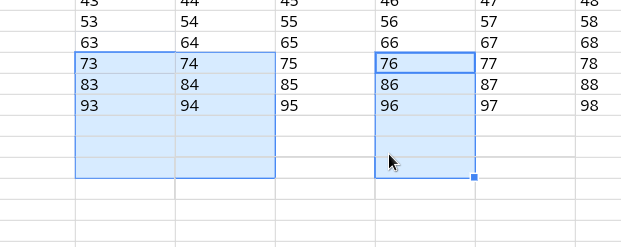
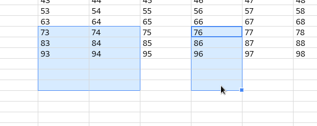
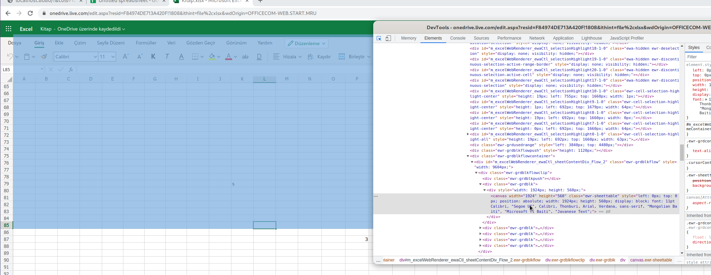

# Improving Rendering & Performance 

This document is related to the MR [Improve rendering & performance](https://github.com/xdatadocs/canvas-datagrid/pull/88)
and talks about the decisions that was made within it. 

The topics that are covered here are:

* Timing a drawing event
* `requestRedraw()` and `redrawCommit()` instead of `draw()`
* Caching cells to improve performance
* Avoding antialiasing effects
* When to `save()` and `restore()` within a canvas
* The reason for the delay when updating a large canvas (4 or more monitors wide) even with caching

## Timing a drawing event

We no longer draw immediately after `self.draw()` is invoked. Instead, doing
so sets every dirty flag to true, which is then read by the scheduled draw 
operation to actually draw.

The scheduler uses `requestAnimationFrame()` which makes the actual draw an
asynchronous operation. This also helps us avoid damaging a frame that is yet
to be pushed to the computer screen. With that said, we still support synchronous 
drawing which can be enabled by setting `drawSynchronously` attribute to true. 
We need that option because we still use synchronous drawing in the tests for
convenience. 

As a part of this change, we also have two new drawing methods to replace the 
existing `draw()` method. You can read more about them below.

## `requestRedraw()` and `redrawCommit()`

These are the two new drawing methods that replace the existing `draw()` method. 

### Short explanation

* Do NOT use `draw()` for the new code and replace it with those two where you can.
* Use `requestRedraw()` whenever you need a redraw.
* Put `redrawCommmit()` at the end of the event methods or in places where `draw()` was.

DO NOT DO:
```ts
mousemove = (e?: Event) => {
    const { self } = this;
    let changed = false; 
    if (selectionChanged) {
        changed = true;
    }
    if (fillOverlayChanged) {
        changed = true;
    }
    if (changed) self.draw();
};
```

DO:
```ts
mousemove = (e?: Event) => {
    const { self } = this;
    if (selectionsChanged) {
        self.requestRedraw('selection');
    }
    if (fillOverlayChanged) {
        self.requestRedraw('fillOverlay');
    }

    self.redrawCommit();
};
```

### Long explanation

### `draw()`

With the asynchronous drawing is in place, `draw()` almost always does what 
`requestRedraw()` would do. The difference is `requestRedraw()` does not draw
when synchronous drawing is enabled, but `draw()` does, which is bad for 
performance if you call it multiple times in the same time frame.

### `requestRedraw()`

This method invalidates a certain drawing area for a redraw but doesn't actually
draw. Drawing is done by the scheduler if asynchronous drawing is enabled. 
However, in synchronous drawing mode (like in tests), this will need 
`redrawCommit()` at the end of the functions where `draw()` would be. 

Simply put, we want to keep both synchronous drawing for tests but also 
want to be able to invalidate a certain drawing area without worrying about 
performance or multiple unchecked invocations (addressing the issue of calling
`draw()` multiple times in the same method).

### `redrawCommit()`

This method is only effective when there are dirty areas and the current 
drawing method is synchronous (like they are in tests). Calling this (when
those conditions are met) triggers a redraw ensuring we still draw when 
asynchronous drawing is not available. In other words, this method does what `
draw()` used to do, but without the need for a special care to invoke it only 
once per drawing cycle.

## Caching cells to improve performance

Initially, I was going to only cache the cell data with the assumption that 
bringing the cell **data** together to draw was taking too long. However, after
separating the accumulation of the cell data to draw and the actual drawing, 
I found out that **drawing** was taking a lot longer than generating the cell
data. For instance, on a very large window, drawing was taking around 40ms to 
finish whereas cell data generation was around 5ms. With that in mind, 
I disabled some of the elements to find out what taking the most time. Turns
out, on an empty grid, **drawing borders** are more expensive than drawing the 
cell background, taking an almost 10ms to draw. Kanryu
merged [a commit](https://github.com/xdatadocs/canvas-datagrid/pull/90) where, 
instead of using paths 4 times for each border, `strokeRect()` is used to to 
reduce the amount of time it takes to make the draw cell borders. However, that
wasn't enough, as we were still losing a lot of frames on a large grid.

### Caching

#### Future Considerations

When caching, we use the invalidation flags to know when we need to update an
area of the cells. Cells are the only things that are cached, and all the other
things like (reorder markers, resizing, and scrolling) do a full redraw. This is
because we don't have a sophisticated method to know which cells should be drawn
due to something that was drawn over them (such as the reorder markers) no 
longer being there. For that, we would need a way to treat elements drawn over 
each other as if they were on different layers and would need to keep track of 
things that are visible and things that are no longer visible, which might need 
planning and testing before implementing. Also, at that point we could just HTML
tables, since we would slowly be approaching to what a layout manager would 
normally do.

Another thing we can do to achieve layering is using multiple canvases. We can
stack them together use the most-bottom one for cells, the one on top of that 
for cell props such as selection handle and borders, and the one on top that
for headers etc. That would eliminate the need for keeping track of things, 
meaning a prop (e.g., a selection handle), can keep track of the its previous 
location and clear the previous location when changing positions.

#### Caching cells

Currently we cache normal cells and headers. As you are aware, headers are 
drawn on top cells, which means if the cells below them are redrawn, headers
on top of them also need a redraw. To do that, we cache the redrawn cells 
as props inside `DrawFrameCache.visibleProps` which is then used by
`DrawFrameCache.isUnderPop()` which checks if a given rect (a cell in this case),
is overlapping a previously drawn (redrawn in this case) prop, and when true, we
consider that cached cell invalidated. Also, for different events such as
selection change, we have a different invalidation point, which is checked by
`DrawCell.isCellCacheInvalid()` method to find out a given cell is affected 
by that event. Right now, we have `selection`, `moveOverlay`, and `fillOverlay`
invalidation points to specifically redraw cell when those change. To give an 
example, if `selection` needs a redraw, we check if the selection state of 
a cached cell has changed and if it did, we recreate that cell. With that said, 
`DrawFrameCache.isUnderProp()` and `DrawCell.defineCustomBorders()` is always
used during a partial refresh because it is easy to figure out if selection
state has changed, but figuring out if a cell is still bordering a selection
(thus has a specific selection border) is hard to figure out. 
`DrawCell.defineCustomBorders()` also checks fill overlay and drag move borders.
It also checks if the cell's `selectedCount` has changed which indicates how
many times a cell was selected by different selections. If any of those change,
`DrawCell.defineCustomBorders()` returns `true` causing a redraw for a given cell.
Also, the reason for `DrawFrameCache.isUnderProp()` being used all the time is 
because selection handles (drawn over the cell corners) have the possibility to 
change positions with a selection change, so we keep track of their last 
location to do a redraw for the cells that were under them and to clear the mark 
they leave behind. 

##### Borders Problem

The problem with borders is that, when a cell background is drawn, the right
and bottom borders of the previous cell are slightly erased because the new
bg slightly touches them. To prevent them from being erased, we now draw them 
separately, meaning all the cells are drawn and their borders drawn over them. 
However, redrawing a cell still was causing the same issue, and simply redrawing
the borders of the redrawn cell wasn't enough because the previous cell could 
have a special border (such as a selection border), so we needed to prioritize
them, which I did by adding two new properties to `DoublyLinkedNode` called 
`upperNode` and `lowerNode`. With them, a cell can now access the cell above
and below (along with the next and previous cells) and decide which border to 
draw based on the priority.

## Avoding antialiasing effects

Not using whole numbers when drawing onto the canvas causes an antialising 
effect which also adds undesired transparency which leaves a mark when they are 
drawn over. To avoid that, using whole numbers are important. Using them also 
gives us sharper borders. Here is a comparison:

*Antialiasing present (bad):*



*Antialiasing NOT present (good):*



## When to `save()` and `restore()` within a canvas

Using `save()` and `restore()` is mostly cheap, however, using them 
in the most circulating functions such as in drawing indivual borders of 
cells can impact the performance. Ideally, using those two for clipping only 
should be enough, and for other cases, restoring the style by hand should do 
the trick. That said, your mileage may vary, so you don't need to follow
this suggestion if you think there is no impact. 

## Why the observable delay with large windows even with caching

Although caching does improve the performance, what it also does is computation
to invalidate the cached cells that might have changed in each frame, so even 
though we are not drawing, we still travel all of the cached data and recreate 
smaller chunks of it for each frame, which takes less than drawing but still 
takes time. To improve that, we can keep track of what has changed instead
of trying to figure out what has done so. For instance, in the case of 
selections, we can keep track of the selection has changed, and only update the 
cells contained by it.

Looking at Excel online, we see that they use small canvases for an area of cells, 
and update those individually (propably by figuring out what has changed first). 
They might also be doing what I suggested above (keeping track of things 
that have changed). 


